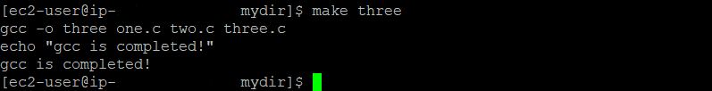
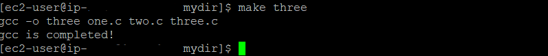

### 오늘의 주제 : 프로그램 컴파일과 실행, 그리고 디버깅

**프로그램 컴파일하고 실행하기**

c 프로그램 컴파일은 gcc 컴파일러를 쓴다. c++은 g++를 사용한다.  

ex. `gcc a.c`를 입력하면 컴파일이 되고 `a.out`이라는 실행 파일이 만들어진다.  


리눅스 환경을 사용하기 위해 EC2를 이용하고 있는데 gcc를 설치하려고 하니 root 계정에서만 된다고 해서;; root 계정 활성화를 위해 잠시 구글링을 했다.  

내가 참고한 사이트는 [ec2 root 계정 활성화시키기](https://ryanwoo.tistory.com/6https://ryanwoo.tistory.com/6)    

많은 도움이 됐읍니다. 감사합니다.  


컴파일한 a.out을 실행하기 위해서는 `./a.out`을 입력하면 된다. 그러면 프로그램이 실행되고 화면에 출력이 된다!  


**다른 이름으로 실행 파일 만들기 ** 

a.c를 만약 ex.out이란 이름의 실행 파일로 만들고 싶다면  

`gcc -o ex a.c` 명령어를 입력하면 된다.  (o는 object의 의미)

ex가 실행 파일의 이름이 되고 a.c는 컴파일할 파일이다.  

ex 파일을 실행한다면 `./ex`를 입력하면 된다.  


**더 많은 사용 방법**  

`$ gcc [option] sourcefiles`  

option으로 -c  = 링크는 하지 않고 컴파일까지만 함. `.o` 파일이 생성됨. (목적 파일)

컴파일한다 = object 파일과 라이브러리를 묶어(link) 실행파일로 만드는 것.  

링크 안하고 object 파일만 만들고 싶다면 -c 옵션을 주면 된다.  


**컴파일 시 오류 발생 및 해결하기**

컴파일 시 오류 = syntax error  

오류가 있는 상태에서 컴파일하면 오류 메시지를 출력한다. 만약 아래처럼 ;을 빼먹은 채로 저장을 한 후 컴파일을 했다고 해보자.  

  

이 파일을 컴파일하면  

 

이렇게 오류 메시지를 출력한다.  


**여러 소스 파일로 나뉘어져 있는 경우**  

one.c 파일과 two.c 파일을 컴파일해 하나의 실행 파일을 만들 경우 컴파일 명령어는 다음과 같다.  

`$ gcc -o three one.c two.c`  

three가 실행 파일의 이름이고 뒤에 오는 c 파일들이 소스 파일들이다.  

만약 `-o three` 옵션없이 `gcc one.c two.c`를 실행하면 a.out이란 실행 파일이 만들어진다.  

왜 항상 이름이 a.out일까?  

> **a.out**은 과거 [유닉스 계통](https://ko.wikipedia.org/wiki/유닉스_계통) [운영 체제](https://ko.wikipedia.org/wiki/운영_체제)에서 사용하던 [실행 파일](https://ko.wikipedia.org/wiki/실행_파일)과 [목적 파일](https://ko.wikipedia.org/wiki/목적_파일) 형식이다. 이후에는 [공유 라이브러리](https://ko.wikipedia.org/wiki/공유_라이브러리) 형식으로도 사용되었다. a.out이라는 이름은 [어셈블러](https://ko.wikipedia.org/wiki/어셈블러) 출력(assembler output)을 줄인 말이다. a.out을 사용하던 대부분의 운영 체제는 이후 [ELF](https://ko.wikipedia.org/wiki/실행_및_링크_가능_포맷) 형식으로 대체하였다. 현재 a.out라는 명칭은 몇몇 [컴파일러](https://ko.wikipedia.org/wiki/컴파일러)나 [링커](https://ko.wikipedia.org/wiki/링커_(컴퓨팅))에서 출력 파일명 기본값으로 사용되는 것에서 흔적을 찾을 수 있다. (출처 : 위키백과)


그렇다고 한다.  


그럼 one.c와 two.c를 컴파일 하여 a.out이란 실행 파일이 만들어져 있는 상태에서  

three.c 파일을 만들어 one.c two.c three.c를 컴파일한다면?   

one과 two를 컴파일 했을 때 만들어졌던 a.out이 위 세 가지 파일을 컴파일한 결과로 덮어쓰기된다.     

이전의 a.out은 없어지는 것이다.  


**만약 컴파일할 파일이 겁나 많다면? Makefile과 make**

먼저 make 도구를 사용하는 이유는  

`gcc -c main.c foo.c io.c` 명령어로 각각의 목적 파일을 만든 상태라고 해보자.  

그럼 파일 목록은 main.c main.o foo.c foo.o io.c io.o가 된다.  

그런데 각각의 목적 파일을 만들어둔 상태에서 main.c의 내용을 변경했다면??  

상식적으로 main.o를 다시 만들어야 할 것이다. 변경된 내용을 반영하려면 컴파일을 다시 하는게 맞다.  

main.c의 내용을 변경한 상태에서 `gcc main.o foo.o io.o`를 실행해 a.out을 만들고 a.out을 실행한다면 그 실행 파일엔 main.c의 변경된 내용이 반영되어 있지 않다.  

항상 최신 상태로 실행 파일을 만들기 위해서는 .c 파일을 만든(변경한) 시간이 .o 파일을 만든 시간보다 이전이어야 한다는 거다.  (ex. .c 파일 만든 시간 : 17시 40분이면 .o 파일 만든 시간 : 17시 42분이어야 됨.)  

이걸 하나하나 사람이 확인할 수도 있지만 이를 make를 이용해 대신 할 수 있다.  

.c 파일의 시간과 .o 파일의 시간을 비교해 .o 파일의 시간이 더 최신이라면 다시 컴파일을 수행하지 않는다. 반대의 경우라면 다시 .c 파일을 컴파일하고.  


**make 도구를 사용하기 위한 Makefile**  

make를 사용하기 위해선 Makefile을 만들어야 한다.  

*Makefile의 형식*  

```
target_list : dependency_list
	command_list
```

- target_list : 목표.
- depandency_list : 명령어 실행을 위해 필요한 파일들을 적는다. 
- command_list : 목표를 달성하기 위해 어떤 명령어를 어떤 순서로 실행할지를 나열함.


ex. one.c와 two.c 파일을 컴파일해 three라는 실행 파일 만들기  

```
three : one.c two.c
	gcc -o three one.c two.c
```


주의할 점 : 명령어 적는 곳의 들여쓰기를 space가 아닌 tab 키 하나를 눌러서 해야 함!  

그리고 Makefile은 앞 글자를 대문자로 한다. makefile도 된다.    


Makefile을 완성했다면 터미널에 `make` 명령어를 쳐 실행시키면 끝이다.

make 입력하면 Makefile을 찾아 그 안에 있는 명령어를 쭉 실행시킨다.  

(Makefile은 작업지정서같은 느낌)  


만약 다른이름으로 Makefile 만들기  

make에게 알려줘야 됨. 만약 Makefile을 this_makefile이란 이름으로 만들었다면  

`make -f this_makefile`  명령어를 입력한다. (f = file의 의미)  


Makefile 안에 target이 여러개일 경우 make 명령어를 쓸 때 `make three` 처럼 target의 이름을 명시해준다. 만약 target이 여러 개있는 상태에서 make 명령어에 따로 target을 명시하지 않을 경우 제일 앞에 있는 target이 선택되어 실행된다.  


**Makefile의 예시**  

```
CFLAGS = -O3 -Wall
CC = gcc
OBJS = one.o two.o

morph : $(OBJS)
	$(CC) -o three $(CFLAGS) $(OBJS)
	
clean :
	@rm -f $(OBJS)
	@rm -f three

.c.o : 
	$(CC) $(CFLAGS) -c$*.c
```

맨 위에 세 가지 = 각 자리에서 사용할 이름을 정의한 것  

.c.o는 target으로 쓰는 건 아니고 .c 파일을 .o 파일로 만들기 위한 규칙  

=> .c가 .o로 가기 위해선 이 명령어를 실행하라는 것.  


`make morph`를 실행했을 때 필요한 재료는 one.o two.o다. 그런데 이 두 개가 아직 만들어져있지 않은 상태라면 one.o two.o 파일을 만들기 위해 .c.o을 자동적으로 실행시킨다.  


만약 .o 파일이 만들어져 있는 상태에서 소스 파일을 고쳤다면,  

.c가 변경된 시간이 .o보다 앞서게 된다. 이 때 make가 시간을 비교하게 되고 .c가 .o보다 최근이라면 다시 컴파일하여 .o 파일을 생성한다.  (재료를 최대한 신선한 상태로...)  


clean은 .o 파일과 실행 파일을 삭제하는 명령어.  

clean의 command_list 자리에 오는 명령어들에는 @가 붙어있는데 @가 붙은 명령어는 화면에 나타나지 않는다. 기본적으로 make를 실행하면 command_list 자리에 있는 명령어들이 화면에 나타나는데 @를 붙이면 화면에 나타나지 않는다.  

무슨 말이냐면  

만약 Makefile을 아래와 같이 만들었다고 해보자.  

```
three : one.c two.c three.c
	gcc -o three one.c two.c three.c
	echo "gcc is completed!"
```

그리고 make three를 실행하면 터미널에 

  

 

두 개의 명령어가 화면에 출력되고 echo 실행의 결과인 gcc is compiled가 출력된다.  

그런데 아래처럼 Makefile을 만들면  

```
three : one.c two.c three.c
	gcc -o three one.c two.c three.c
	@echo "gcc is completed!"
```

결과는 아래와 같다.  



echo 명령어가 화면에 나타나지 않는 것이다.  


#### 디버깅

gdb 디버거를 주로 쓴다.  

사용 방법은 생략.  


gdb를 쓰기 위해서는 컴파일할 때 -g 옵션을 명시해 실행파일을 만들어야 한다.    

ex. `gcc -g -o test test.c`  


디버거만 실행할 경우는 `gdb test`  


  


  


 


 


